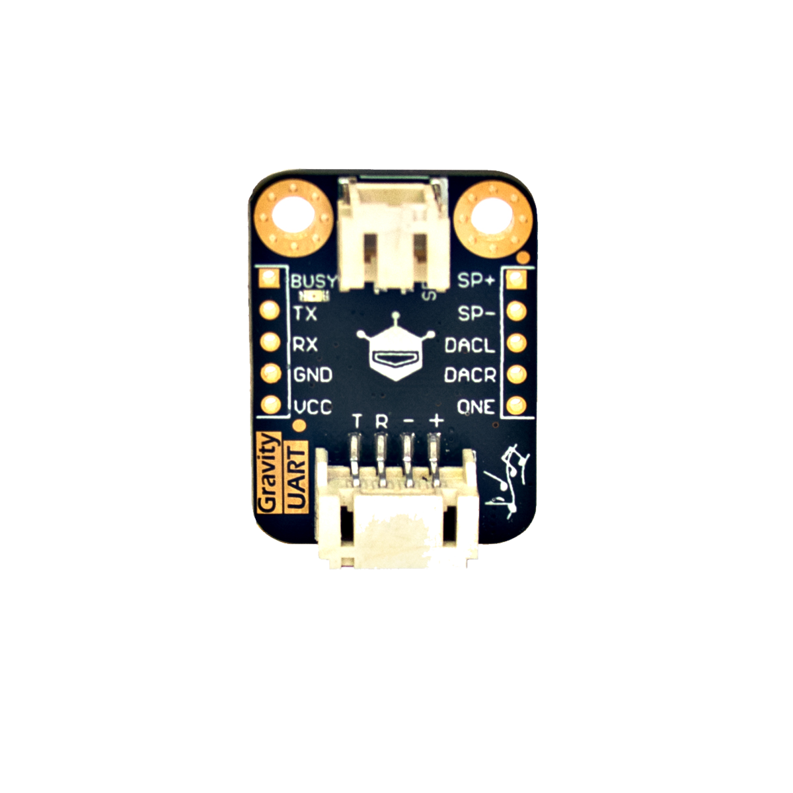

# MP3-Modul

## Beschreibung
Das MP3-Modul ermöglicht das Abspielen von Musik oder abgespeicherten Tönen. Es integriert einen Speicherplatz von 8 MB, auf dem Musikdateien im mp3- oder wav-Format über einen Mikro-USB-Anschluss gespeichert werden können. Um die Musik auszugeben, lässt sich ein Lautsprecher an die dafür vorgesehenen Steckplätze anschließen.

Das Modul wird über die serielle Schnittstelle UART direkt oder mithilfe des Grove Shields an einen Mikrocontroller angeschlossen.

Alle weiteren Hintergrundinformationen sowie ein Beispielaufbau und alle notwendigen Programmbibliotheken sind auf dem offiziellen Wiki (bisher nur in englischer Sprache) von DFRobot zusammengefasst. Die genaue Bezeichnung des integrierten Sensors, die bei der Suche von Beschreibungen und Anleitungen wichtig sein kann, lautet DFR0534.

<!-- infolist -->

<!-- infolists -->
## Wichtige Links für die ersten Schritte:

- [## DFRobot Wiki](https://wiki.dfrobot.com/Voice_Module_SKU__DFR0534#target_0)

## Weiterführende Hintergrundinformationen:

- [## UART – Wikipedia Artikel](https://de.wikipedia.org/wiki/Universal_Asynchronous_Receiver_Transmitter)
- [GitHub-Repository: MP3-Modul](https://github.com/s-light/MYS__68-MP3-Modul/blob/master/DFR0534/README.md)

